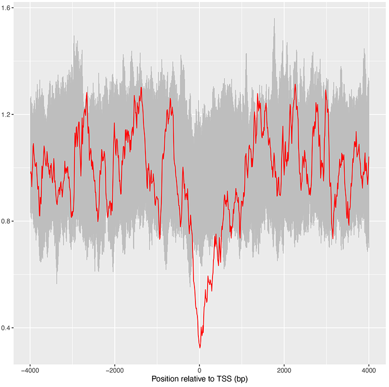
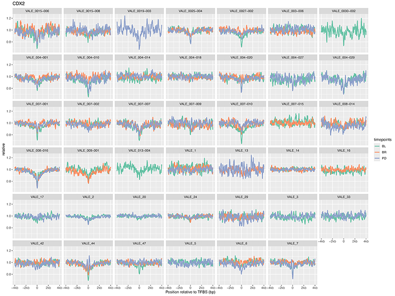
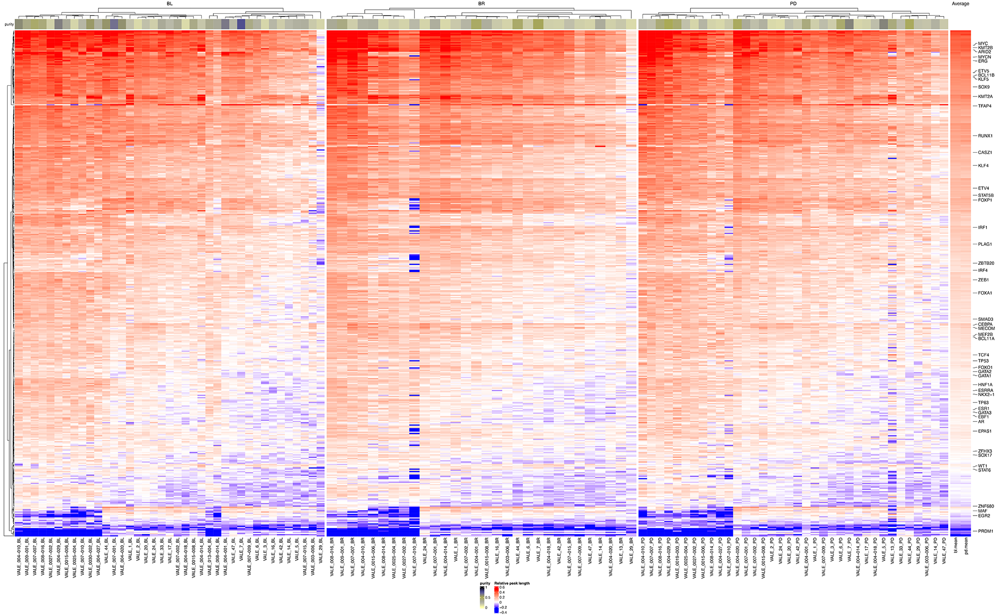

# NF-FRAGMENTOMICS PIPELINE

## Introduction

Recent research indicates that analyzing the fragmentation patterns of circulating free DNA (cfDNA) from genome sequencing data can provide insights into nucleosome occupancy in the original cells. In accessible genomic regions, nucleosomes are arranged systematically to facilitate access for DNA-binding proteins.


## Pipeline Summary

This pipeline calculates the composite coverage over specific genome regions.


BAM input files are filtered by size (cfDNA fragments have sizes between 90 and 150 bp) and corrected for GC-bias using the method proposed by [Benjamini & Speed (2012). Nucleic Acids Research, 40(10)].

The input BAM is then converted into a coverage file (bigWiggle). At this stage, it is possible to use a blacklist of genomic regions. We are blacklisting the Problematic Regions of the Genome defined by ENCODE. [Amemiya, H.M., Kundaje, A. & Boyle, A.P. The ENCODE Blacklist: Identification of Problematic Regions of the Genome. Sci Rep 9, 9354 (2019). https://doi.org/10.1038/s41598-019-45839-z]

With [computeMatrix](https://deeptools.readthedocs.io/en/latest/content/tools/computeMatrix.html), we calculate the coverage of the signal (BAM file) on a set of targets (BED file). In our analysis, this is typically a set of Transcription Factor Binding Sites regions. We are using the `reference-point` mode: we compute the signal distribution relative to a point (the TFBS center point in our case), expanding on both sides for **4kb**.

A first plot of the composite coverage on the TFBS target set (raw coverage) is generated by the process [plotHeatmap](https://deeptools.readthedocs.io/en/latest/content/tools/plotHeatmap.html).


The process `PEAK_STATS` generates 4 output files:

 - `matrix.RDS` matrix in RDS format
 - `peak_data.tsv` file contains the composite coverage (`coverage`) for each bin (`bin`), the coverage relative to the background median (`relative`), and the background mean (`background_mean`).
 - `peak_stats.tsv` summary statistics (see below)
 - `RawSignal.pdf` pdf plot of the calculated metrics
 - `RelativeSignal.pdf` pdf plot for the relative signal metrics


### Peak metrics


1. `signal`: name of input sample
2. `target`: name of input target set
3. `source`: source of target 
4. `integration`: montecarlo integration of peak using `background.mean`
5. `background.mean`: mean calculated of extreme of distribution.
6. `referencePoint.bin`: bin location of referencePoint.
7. `referencePoint.coverage`: composite coverage at reference point.
8. `referencePoint.relative`: composite relative coverage at reference point.
9. `central.coverage`: composite central coverage as defined in [Griffin](https://www.nature.com/articles/s41467-022-35076-w).
10. `central.coverage.bin.min`: bin left limit of composite central coverage.
11. `central.coverage.bin.max`: bin right limit of composite central coverage.
12. `background.left.limit`: bin left limit for `background.mean`.
13. `background.right.limit`: bin right limit for `background.mean`.
14. `average.coverage`: average coverage as defined in [Griffin](https://www.nature.com/articles/s41467-022-35076-w).
15. `average.coverage.bin.min`: bin left limit of composite average coverage.
16. `average.coverage.bin.max`: bin right limit of composite average coverage.
17. `peak.length`: length of peak (green dotted line in the example)
18. `peak.relative.length`: length of peak (green dotted line in the example)


## Quick Start


Required input params:

```
input: "./examples/input/example_samplesheet_bam.csv"
targets: "./examples/input/example_targets.csv"
outdir: "./results"
genome_2bit: "./tests/input/stub/GRCh38.2bit"
blacklist_bed: "./tests/input/stub/ENCODE_Blacklist_V2.bed"
```

### INPUT

Input is a samplesheet with bam or bw (bigWiggle) samples.

Example of `samplesheet.csv`:

```
caseid,sampleid,timepoint,bam,bai,bw
PATIENT_A,PATIENT_A_T1,T1,/path/to/bam.bam,/path/to/bam.bai,
PATIENT_A,PATIENT_A_T2,T2,/path/to/bam.bam,/path/to/bam.bai,
```

Where: 

 - `caseid` is the patient
 - `sampleid` is the sample
 - `timepoint` is the time group
 - `bam` is the input BAM file
 - `bai` is the BAM index
 - `bw` is the (optional) big wiggle file (preprocessing will be skipped)

### TARGETS

Example of target list (`targets.csv`):

```
name,source,bed
MYC,GRIFFIN,./tests/input/stub/myc.bed
ELK4,TIMON,./tests/input/stub/elk4.bed
rand1,house_keeping_dataset,./tests/input/stub/rand1.bed
rand2,house_keeping_dataset,./tests/input/stub/rand2.bed
rand3,house_keeping_dataset,./tests/input/stub/rand3.bed
HouseKeeping,house_keeping_dataset,./tests/input/stub/GeneHancer_housekeeping.bed
```

Where:

 - `name`: name of the target 
 - `source`: source of the target is, in many cases, the enclosing folder of the bed file. Different sources will be separated in publish dir.
 - `bed`: bed file with targets


### GENOME

`genome_2bit`: Genome in two-bit format. Most genomes can be found here: http://hgdownload.cse.ucsc.edu/gbdb/

### BLACKLIST BED

`blacklist_bed`: BED file with blacklisted regions used in COVERAGEBAM (wiggle file generation) and in COMPUTEMATRIX (matrix calculation). 

We are using the ENCODE blacklist from:
 
    Amemiya, H.M., Kundaje, A. & Boyle, A.P. The ENCODE Blacklist: Identification of Problematic Regions of the Genome. Sci Rep 9, 9354 (2019). https://doi.org/10.1038/s41598-019-45839-z

### GENOME SIZE

`genome_size`: effective genome size used by GC Correction functions (see also: [deeptools effective genome size page](https://deeptools.readthedocs.io/en/latest/content/feature/effectiveGenomeSize.html))

### PROFILES

Available profiles (see also `conf/profiles.config`):

 - `stub`: run with stub true
 - `debug`: run with debug true
 - `devel`: run locally
 - `slurm`: for our HPC

Some profile examples:

#### Stub

Stub run with stub annotation files:

```
conda activate nf-fragmentomics-env
nextflow run main.nf -params-file examples/input/example_params.yaml -profile stub -stub-run
```

#### Devel with conda

Run on single machine with conda environment:

```
nextflow run main.nf -profile devel,conda -params-file params.yaml
```

#### Whole Genome Sequencing with singularity

Run on slurm cluster with singularity

```
nextflow run main.nf -profile slurm,singularity -params-file params.yaml
```

### BAM PREPROCESSING


### TARGET PROCESSING


## Documentation

### Samplesheet specifications

We tried the analysis with WGS and lpWGS samples.

Input BAM file must be sorted and indexed. 

### Targets specifications

File name or names, in BED or GTF format, containing the regions to compute and plot.

see also [computeMatrix](https://deeptools.readthedocs.io/en/latest/content/tools/computeMatrix.html)

### Required Annotation files

This pipeline use the ENCODE blacklist or other blacklist BED file to remove problematic regions from the analysis.

Param: `blacklist_bed`

### Parameters

 - `preprocess`: if true, the pipeline filters BAM by size, applies GC correction, and converts to wiggle file
 - `bin_size`: the bin size used to generate the coverage file (big wiggle)
 - `target_expand_sx` and `target_expand_dx`: how many bp to expand the Target region? default is 4000 bp on both sides
 - `filter_min` and `filter_max`: limit for reads filtering. By default is 90-150 bp

### Labels

<!-- TODO -->

### Scripts

Utility scripts in the `scripts` directory.

#### SampleSheet Generator

location: `scripts/samplesheet_generator.py`

```
usage: samplesheet_generator.py [-h] [-r REGEXP] [-v] [-vv] FILE [FILE ...]

Generate samplesheet.csv for nf-fragmentomics pipeline

positional arguments:
  FILE                  BAM or wiggle files

options:
  -h, --help            show this help message and exit
  -r REGEXP, --regexp REGEXP
                        Parser regexp - default: ((.*)_(.*))\..*
  -v, --verbose         set loglevel to INFO
  -vv, --very-verbose   set loglevel to DEBUG

Author: Davide Rambaldi
```

Usage example with test files:

```
./scripts/samplesheet_generator.py tests/input/samplesheet_generator/*/*.{bw,bam}
```

#### Targets Generator

location: `scripts/targets_generator.py`

```
usage: targets_generator.py [-h] [-v] [-vv] FILE [FILE ...]

Generate targets.csv for nf-fragmentomics pipeline

positional arguments:
  FILE                  BED files

options:
  -h, --help            show this help message and exit
  -v, --verbose         set loglevel to INFO
  -vv, --very-verbose   set loglevel to DEBUG

Author: Davide Rambaldi
```

Usage example with test files:

```
./scripts/targets_generator.py tests/input/targets_generator/*.bed
```

## Analysis example

Some analysis examples with pseudocode

### Housekeeping plots

To verify if in our dataset it is possible to see a signal from open chromatin regions, we can do the following experiment:

1. We take all the TSS from GeneHancer.
2. We calculate the composite coverage (the peak) of all TSS on housekeeping genes (that should always be active). 
3. We then calculate the composite coverage for 100 sets of randomly picked genes NOT housekeeping.

We first need to load the `peak_data.tsv` files.

These files contain 4 columns:

 * `raw` is the raw signal
 * `bin` is the x position
 * `relative` is the signal relative to the background_median
 * `background_median` is the median calculated as shown above

In R, for example, we can do this:

```r
mdata <- read_delim("path/to/peak_data.tsv", show_col_types = FALSE)
```

We can load the random dataset in an object (random in the next example) and the housekeeping dataset in another object (hk in the next example). 

We can now combine the 2 data in a plot with ggplot:

```r
ggplot() +
    geom_line(data = random, aes(x = bin, y = relative), color="grey", show.legend = FALSE) +
    geom_line(data = housekeeping, aes(x = bin, y = relative), color="red", show.legend = FALSE) +
    scale_x_continuous(
      "Position relative to TSS (bp)", 
      breaks = c(0,200,400,600,800), 
      labels = c("-4kb","-2kb","0","2kb","4kb")
    ) +
    ylab("Relative coverage") +
    ggtitle(plot.title) +
    scale_color_manual(values=c("grey","red")) +
    theme(legend.position = "bottom")
```



The housekeeping signal (red line in the plot) is quite different compared to random gene sets! Do you agree?

### Target plots

Here we want to plot the composite coverage for a single Transcription Factor for a cohort across different timepoints.

We start as above from the `peak_data.tsv` files where:

 * `raw` is the raw signal
 * `bin` is the x position
 * `relative` is the signal relative to the background_median
 * `background_median` is the median calculated as shown above

In this case, it is better to load the single file and merge the data into a single object:

For each peak_data file:

```r
mdata <- read_delim("path/to/peak_data.tsv", show_col_types = FALSE)
```

Mutate rdata to add sample, case, and timepoint:

```r
mdata <- mdata |> mutate(
    sample=sample_name,
    case=case_name,
    timepoint=timepoint_name
)
```

You can now combine different data objects into a single object using `bind_rows`.

On the final dataset, we can use the `bins` on the X axis, the `relative` signal on the Y axis. We group and color observations by timepoint and we split (facet_wrap) plots by patient.

Result:



### Heatmaps with ComplexHeatmap

Given a set of samples and a list of targets, we can build a heatmap of peak lengths or other peak statistics.

In this example, we use [ComplexHeatmap](https://jokergoo.github.io/ComplexHeatmap-reference/book/index.html) and the R package to draw and arrange multiple heatmaps.



<!-- TODO -->

## Credits

<!-- TODO -->

## Contributions and Support

To test the R peakStats script:

```
cd peakStats
../../bin/fragmentomics_peakStats.R -s "Signal" -t "Target" -S "Source" --background-left-limit 50 --background-right-limit 50 ../input/matrix/FOXA2_regions_matrix.gz
```

## Citation

<!-- TODO -->